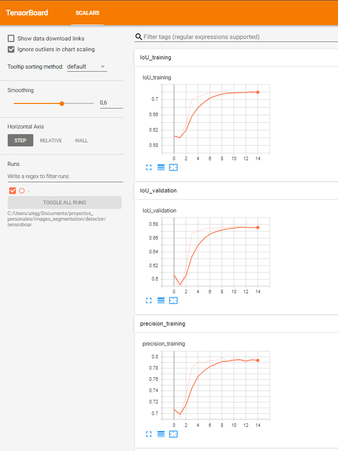
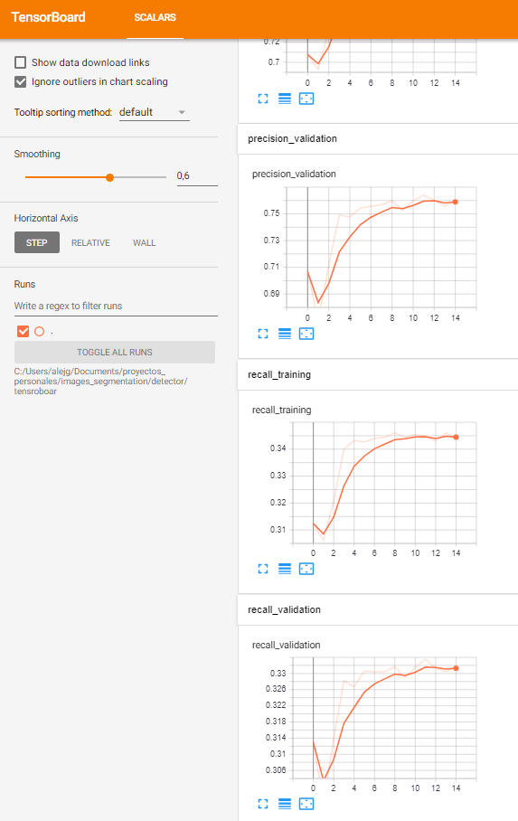
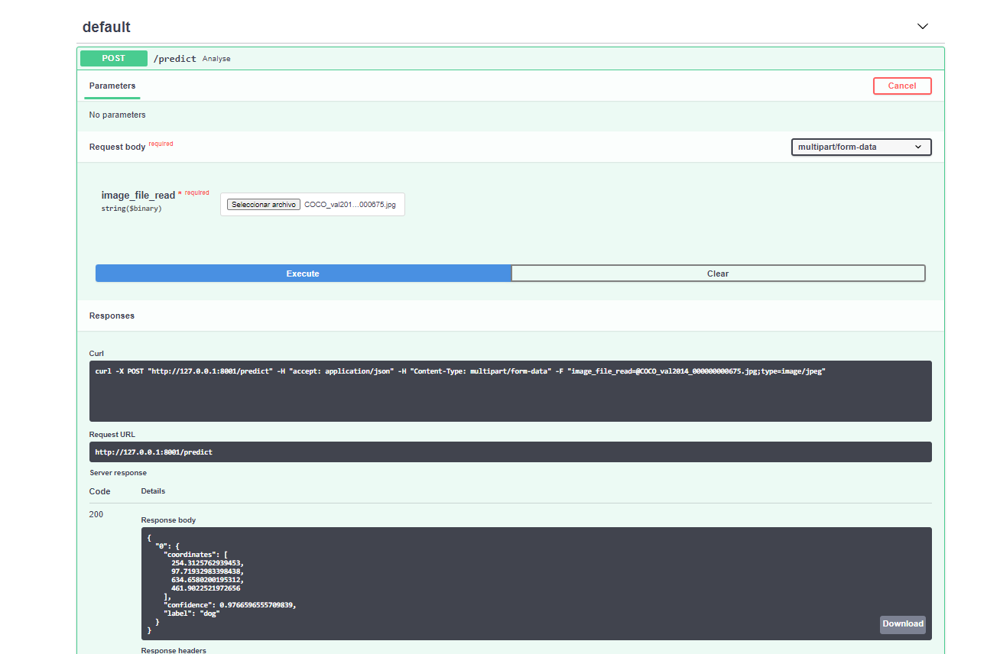

# image detector service

This api receives an image return the coordinate where a persona, animal or object is located

Each version is a improve from previous versions
# versions:

- V1. {person, dogs, cats, other}
- V2. {person, dogs, cats, other, objects}

# Screenshot training

# Screenshot api

# run 

uvicorn backend:app --reload --port 8001

http://127.0.0.1:8001/docs#/default

